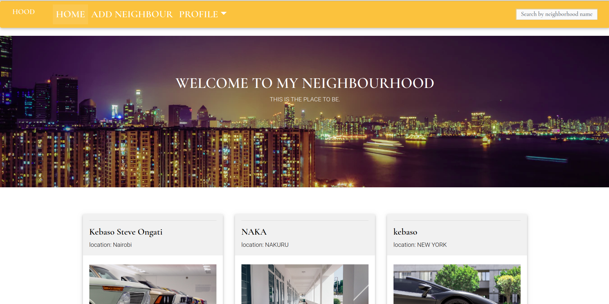

## Project Name

- Neighbourhood

## Author's Name

- Kebaso Steve Ongati

##  Project Description

- Our website basically need a new neighbour to upload his/her neighbourhood and the population of his neigbourhood.

## BDD

- When you come to our website you have create an account with us so that you can upload the information about your Neighbourhood.

### Cloning
* In your terminal:
        
        $ git clone https://github.com/kebasoh/neighbourhod
        $ cd neigbour

## Running the Application
* Install virtual environment using `$ python3.6 -m venv --without-pip virtual`
* Activate virtual environment using `$ source virtual/bin/activate`
* Download pip in our environment using `$ curl https://bootstrap.pypa.io/get-pip.py | python`
* Install all the dependencies from the requirements.txt file by running `python3.6 pip install -r requirements.txt`
* Create a database and edit the database configurations in `settings.py` to your own credentials.
* Make migrations

        $ python manage.py makemigrations mtaa
        $ python3.6 manage.py migrate 

* To run the application, in your terminal:

        $ python3.6 manage.py runserver
        
## Testing the Application
* To run the tests for the class file:

        $ python3.6 manage.py test mtaa

## Technologies used

- Bootstrap
- Python 
- Django
- Postgresql

## Specifications
| Behavior            | Input                         | Output                        | 
| ------------------- | ----------------------------- | ----------------------------- |
| User visits the app and gets directed to the login page  | User logs in | Directed to the home page | 
If user has no account, they click on `sign up` | User signs up | User is redirected to the profile set up page |

## Projects livelink

https://neiba.herokuapp.com/

## Contact Information

- Email:ongatikebaso@gamil.com
- Github:kebasoh

### License

* LICENSED UNDER  